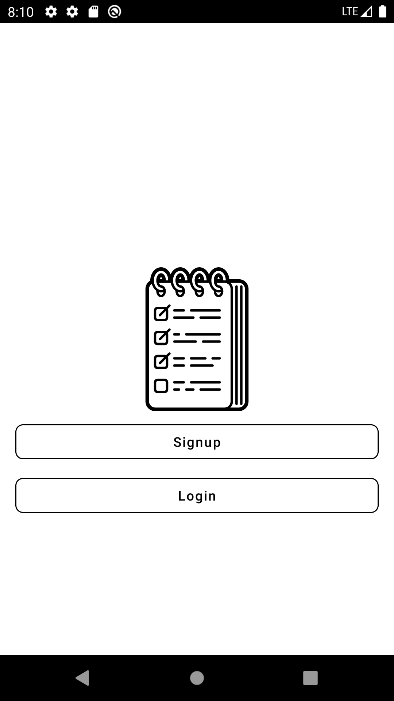
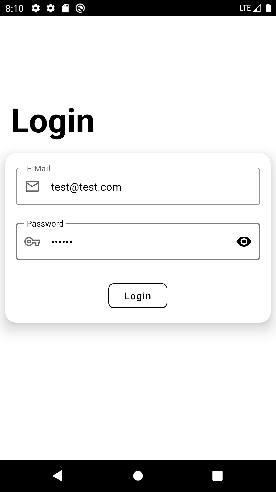
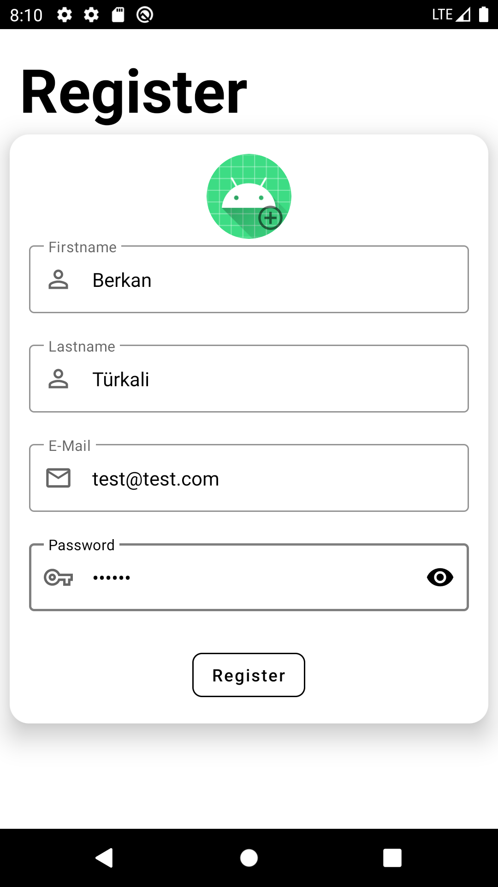
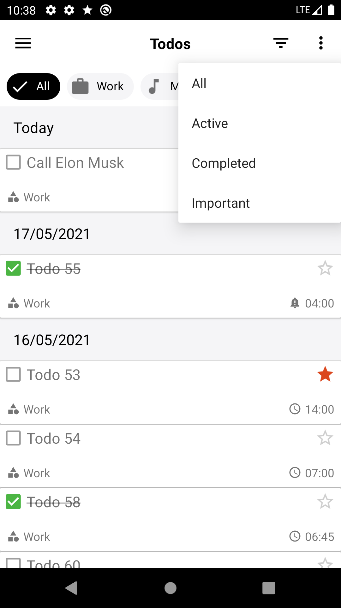
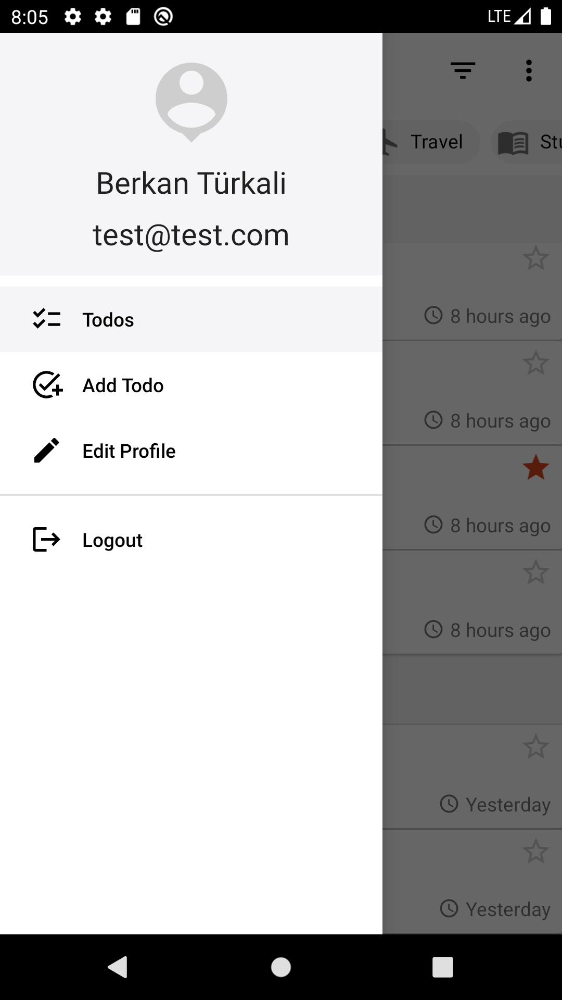
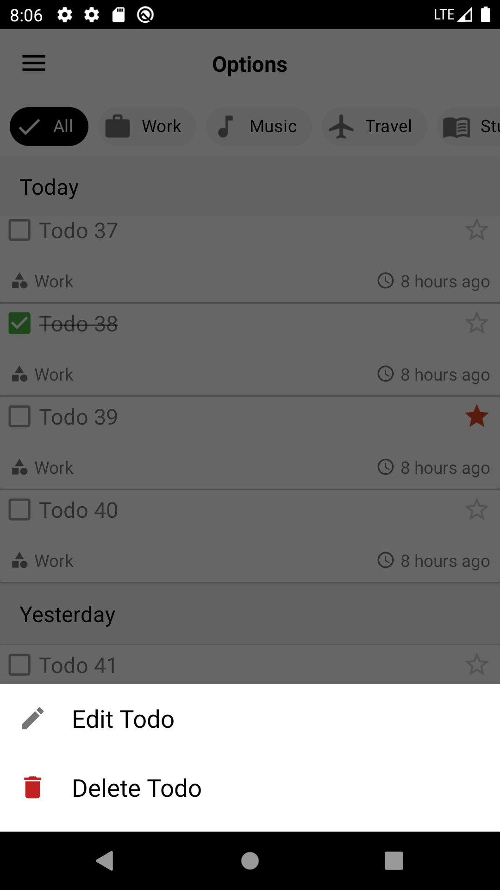
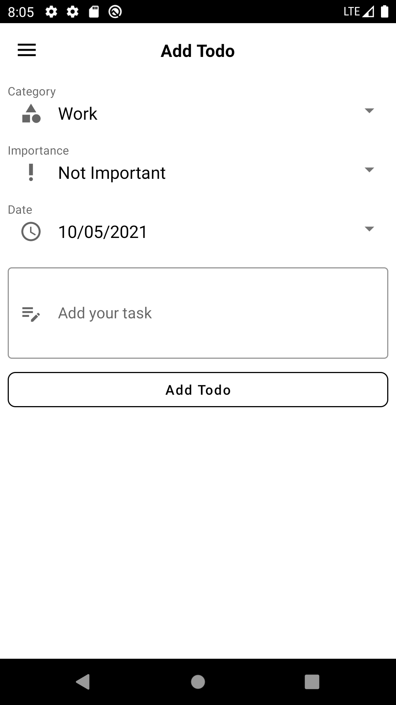
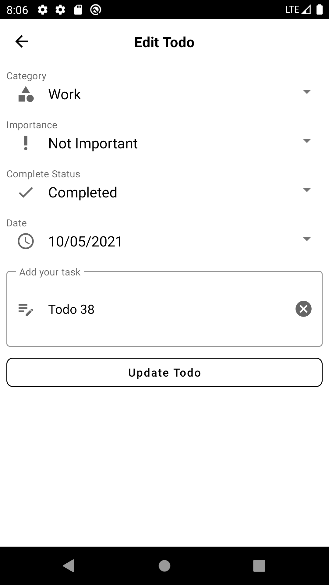
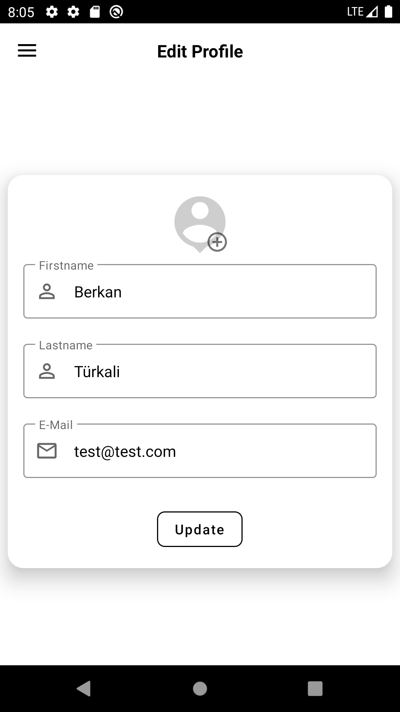
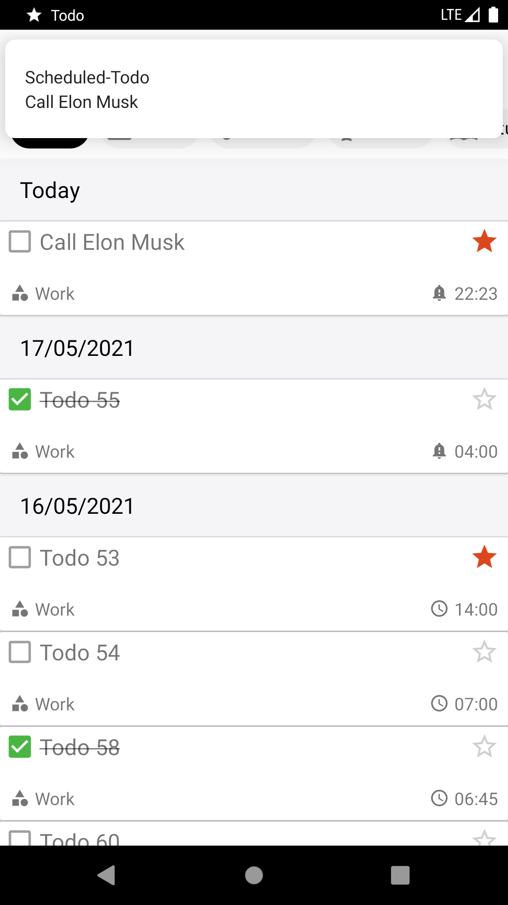

# Todo
## Screenshots
   
  
  

 ## Libraries
  * [Room](https://developer.android.com/training/data-storage/room) 
  * [Nav Component](https://developer.android.com/guide/navigation/navigation-getting-started)
  * [Dagger-Hilt](https://dagger.dev/hilt/)
  * [Retrofit](https://square.github.io/retrofit/)
  * [Glide](https://github.com/bumptech/glide)
  * [Coroutines](https://developer.android.com/kotlin/coroutines)
  * [Paging 3](https://developer.android.com/topic/libraries/architecture/paging/v3-overview)
  * [Lifecycle](https://developer.android.com/jetpack/androidx/releases/lifecycle)
  
  ## Server-Side Code
  * [Repo](https://github.com/berkanturkali/Todo-Server)
