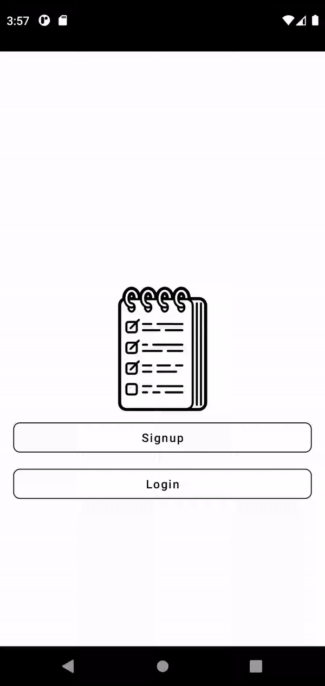

# Todo

Android Todo app with Express + MongoDB

To run the app on an emulator add `http://10.0.2.2:{Port}` with the key `BASE_URL` to the `local.properties` file.

`{Port}` is the port number that you specify in the `config.env` file on the server-side.

|                 Splash Fragment             |               Login & Signup Fragment         |
| :-----------------------------------------: |  :------------------------------------------: |
| |   |

|                 Add Edit Fragment           |                  Home Fragment                |
| :-----------------------------------------: | :-------------------------------------------: |
|  |  |

|             Statistics Fragment             |                  Profile Fragment             |
| :-----------------------------------------: | :-------------------------------------------: |
| |  |

## Libraries
* [Nav Component](https://developer.android.com/guide/navigation/navigation-getting-started)
* [Dagger-Hilt](https://dagger.dev/hilt/)
* [Retrofit](https://square.github.io/retrofit/)
* [Glide](https://github.com/bumptech/glide)
* [Coroutines](https://developer.android.com/kotlin/coroutines)
* [Paging 3](https://developer.android.com/topic/libraries/architecture/paging/v3-overview)
* [Lifecycle](https://developer.android.com/jetpack/androidx/releases/lifecycle)
* [Lottie](https://github.com/airbnb/lottie-android)
* [MPA Chart](https://github.com/PhilJay/MPAndroidChart)

## Server-Side Code
* [Repo](https://github.com/berkanturkali/todo-Server)
